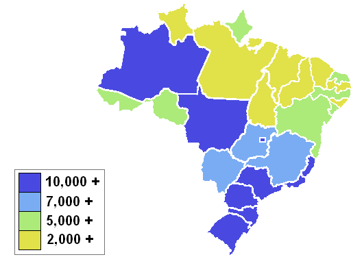

```{r setup, echo=FALSE, results='hide', message=FALSE, warning=FALSE}
# Če želimo nastaviti pisave v PDF-ju, odkomentiramo
# in sledimo navodilom v programu.
#source("fontconfig.r", encoding="UTF-8")

# Uvoz vseh potrebnih knjižnic
source("lib/libraries.r", encoding="UTF-8")
```

```{r rstudio, echo=FALSE, results='asis'}
# Izris povezave do RStudia na Binderju
source("lib/rstudio.r", encoding="UTF-8")
```

# Analiza poslovanja na platformi Olist

Izvedel sem analizo poslovanja na platformi Olist. Platforma Olist prodajalcem ponuja prodajne kanale preko katerih prodajajo svoje izdelke in logistične partnerje preko katerih jih dostavljajo. 


***

# Obdelava, uvoz in čiščenje podatkov

```{r uvoz, echo=FALSE, message=FALSE, warning=FALSE}
source("uvoz/uvoz.r", encoding="UTF-8")
```

Podatke sem uvozil v obliki 8 različnih CSV datotek. Iz njih sem sestavil 3 ključne tabele, ki se potem uporabijo za vizualizacije.

1. `narocila` - podatki o vseh naročilih na portalu
  - `kljuc.narocila` - spremenljivka: ključ naročila (identifikacija)
  - `status.narocila` - meritev: kakšen je status naročila (neurjene faktor: dostavljeno, nedostavljeno)
  - `cas.nakupa` - meritev: čas, ko je uporabnik plačal naročilo (datetime objekt)
  - `dejanski.cas.dostave` - meritev: čas, ko je uporabnik prejel izdelke iz naročila (datetime objekt)
  - `predviden.cas.dostave` - spremenljivka: čas, ki ga je portal predvideval za prejem naročila (datetime objekt)
  - `tip.placila` - meritev: Tip plačilnega sredstva, s katerim je uporabnik plačal naročilo (neurejen faktor:kreditna kartica, boleto, kupon, debetna kartica)
  - `število.obrokov.placila`- meritev: na koliko obrokov so uporabniki kupili naročilo (število)
  - `vrednost.placila`- meritev: vrednost naročila (število)
  - `pravocasnost` - spremenljivka: Ali je bilo naročilo dostavljeno v predvidenem roku dostave (TRUE, FALSE)

2. `produkti` - podatki o vseh izdelkih na platformi
  - `kljuc.izdelka` - spremenljivka: ključ izdelka (identifikacija)
  - `masa.izdelka` - meritev: masa izdelka (gram)
  - `dolzina` - meritev: dolžina izdelka (cm)
  - `sirina` - meritev: širina izdelka (cm)
  - `visina` - meritev: višina izdelka (cm)
  - `kategorija.izdelka` - spremenljivka: v katero kategorijo spada izdelek.

3. `lokacija_narocil` - podatki potovanju narocila
  - `trajanje` - spremenljivka: kako dolgo je trajala dostava do kupca (dnevi)
  - `razdalja` - meritev: merjenje zracne razdalje med prodajalcem in kupcem (km)


  
# Analiza in vizualizacija podatkov

```{r vizualizacija, echo=FALSE, message=FALSE, warning=FALSE, results='hide'}
source("vizualizacija/vizualizacija.r", encoding = "UTF-8")
```

```{r Promet2017, echo=FALSE, message=FALSE, warning=FALSE}
graf_promet
```

> #### Vizualizacija predstavlja kaksen je promet na portalu čez leto.

```{r TipiPlacil, echo=FALSE, warning=FALSE}
graf_tipi
```

> #### Vizualizacija predstavlja število naročil glede na plačilno sredstvo.
> #### Opazimo, da je večina naročil zaključenih z kreditno kartico, saj je 'trenje' pri nakupu najmanjše.

```{r GostotaCen, echo=FALSE, warning=FALSE}
graf_gostot
```

> #### Vizualizacija prikazuje kakšne so gostote cen glede na plačilno sredstvo.
> #### Vidimo, da se nakupi z boletom, kreditno ali debento kartico ne razlikujejo po cenah, medtem ko se z boni v povprečju kupuje nižje vrednosti izdelkov

```{r December2017, echo=FALSE, message=FALSE, warning=FALSE}
graf_december
```

> #### Vizualizacija prikazuje promet portala v mesecu decembru, leta 2017. Nakazuje 'mrzlično' nakupovanje pred božičem.
> #### Bolj kot se bližamo božiču, manj je prometa, saj je verjetnost pravočasne dostave zelo mala.

```{r November2017, echo=FALSE, message=FALSE, warning=FALSE}
graf_november
```

> #### Vizualizacija prikazuje promet portala v mesecu novembru, leta 2017. Tukaj se opazi izrazit promet 
> #### v petek, 24. novembra, ki je znan tudi kot 'black friday'. 

```{r Zemljevid, echo=FALSE, message=FALSE, warning=FALSE}
map
```


> #### Če pogledamo lokacije prodajalcev in bdp na prebivalca, glede na lokacijo v Braziliji,
> #### vidimo da je prodajalcev več tam, kjer je tudi BDP na prebivalca višji. Nakazuje, da je v bolj razvitih delih Brazilije e-trgovina bolj razvit posel.


# Napredna analiza podatkov

 ```{r analiza, echo=FALSE, message=FALSE, warning=FALSE}
source("analiza/analiza.r", encoding="UTF-8")
```

> #### V napredni analizi podatkov bom uporabil preglednico `lokacija_narocil`, prvo sem si ogledal korelacijo med razdaljo in trajanjem.

```{r OdnosKolicin, echo=FALSE, message=FALSE, warning=FALSE}
cor_kolicin
```

> #### Vidimo, da sta spremnljivki rahlo koreliralni. Pogledamo še gostote porazdelitev vsake posebej. 

```{r GostotaTrajanja, echo=FALSE, message=FALSE, warning=FALSE}
gostota_trajanja
```

> #### Kot vidimo, je prva polovica gostote zelo zanimiva, neznam pa je ravno razloziti. V zelo grobem smislu je normalno porazdeljena.
 
```{r GostotaRazdalja, echo=FALSE, message=FALSE, warning=FALSE}
gostota_razdalja
```

> #### Tudi razdalja je porazdeljena dokaj 'lepo', vsaj približno normalno. 


# Shiny 

```{r shiny, echo=FALSE, message=FALSE, warning=FALSE}
shinyAppDir("shiny")
```


 

